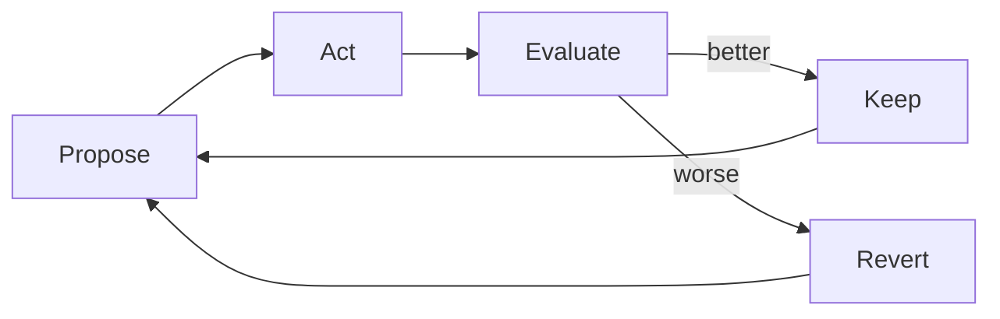
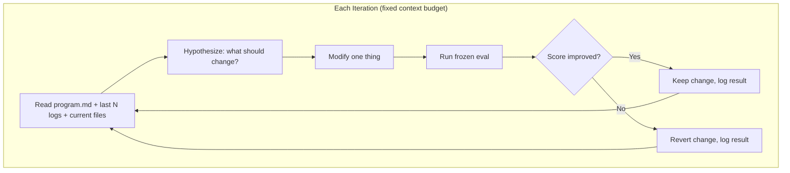
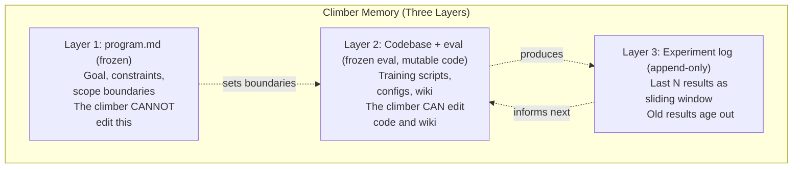
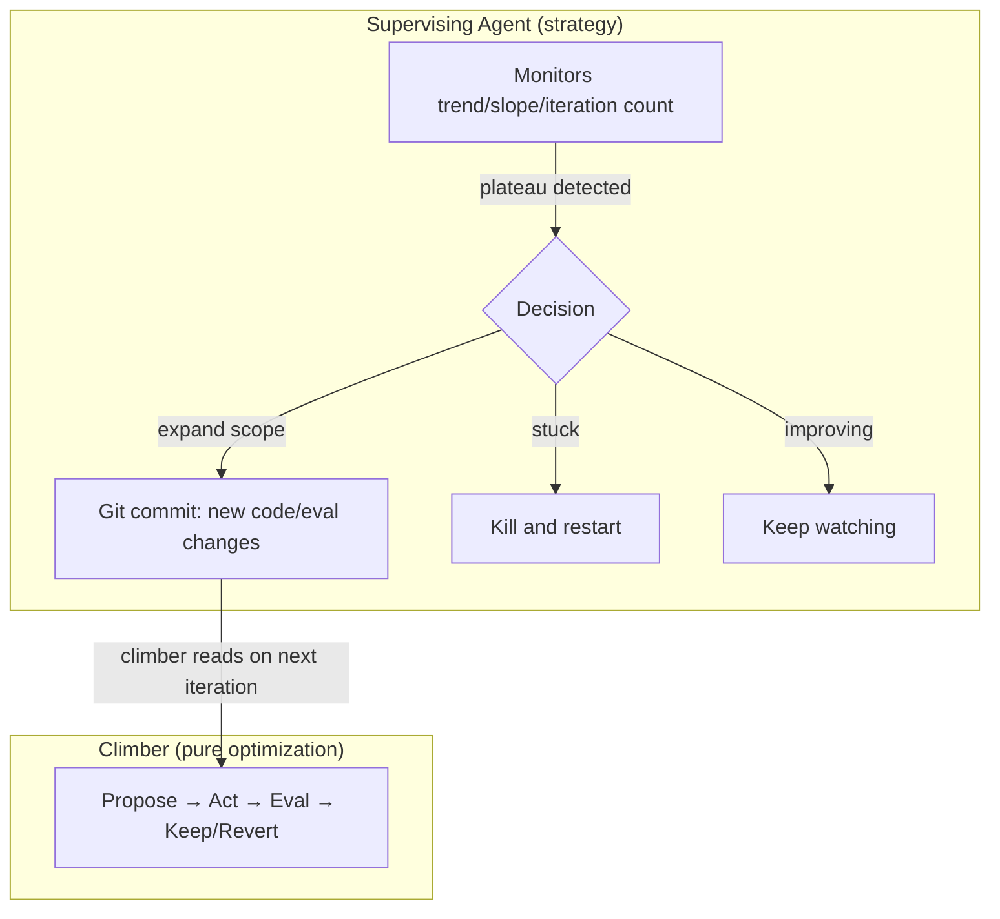

Someone at work asked me this week how I keep my agents busy for long periods of time.

It's a good question. Everyone running agents hits this. You set one up, it does the thing you
asked, and then it stops. Or worse — it keeps going but starts doing **useless things** because it
ran out of meaningful work and didn't know how to find more.

The standard answer is "give it better prompts" or "give it more tools." But I've been running
five agents continuously since December, and the ones that actually stay productive have
something else going on entirely.

# The theory says you need this. It doesn't say how.

[Stafford Beer's Viable System Model][vsm] — a cybernetics framework from the '70s for
understanding how autonomous systems stay viable — has this concept of internal coordination.
The function that decides what to work on, resolves conflicts between competing priorities,
and allocates resources. Beer called it System 3. Every viable system needs it: thermostats,
companies, organisms, agents.

For a thermostat, this is trivial. The temperature is either above or below the setpoint. Done.

For an **unconstrained, fully autonomous AI agent**, it's really hard. Getting an agent to do
something productive without constantly banging it over the head — wow, just like people.

Beer tells you the function needs to exist. He doesn't tell you what it looks like when the
agent is an LLM with a Discord bot and a cron schedule. I think I just figured out the tools.

# Hill climbers: the propose-act-eval loop

A hill climber is an agent that optimizes a system through a tight loop: **propose** a change,
**act** on it, **evaluate** the result, keep or revert. Repeat forever.

When I first built mine — optimizing a machine learning system for contract classification —
I kept them [Karpathy-style][karpathy]: small search space, constrained parameters, tight
guardrails. The agent could edit one training script. That's it.

They kept getting stuck in **local minima**. F1 would plateau at 0.25 and just oscillate.

The instinct was right — start constrained, don't let the agent go wild. But by removing its
ability to explore, I'd removed its ability to *contribute*. [Lily][lily] put it well this
week — **use AI for things that need intelligence**. I was using AI for things that needed a
for-loop.

## How the loop actually works

The climber is a headless subagent — no personality, no memory blocks, no conversation
history. Just a goal, a set of files it can edit, and an eval script it can't touch.

Each iteration:

1. **Read current state** — the climber loads its program (frozen), the last N experiment
   results (sliding window), and the current codebase (mutable)
2. **Propose** — based on what it reads, it hypothesizes what to change. This is where
   the LLM actually contributes — it reads failing cases and generates *targeted*
   hypotheses, not random mutations
3. **Act** — apply the change. One change at a time so you know what helped
4. **Evaluate** — run the frozen eval script. Compare against the previous best
5. **Keep or revert** — better? Keep the change. Worse? Roll it back. Either way, log
   the result

The critical constraint: **every iteration starts with roughly the same-sized context**.
The climber doesn't accumulate conversational history. It reads its program, reads a
*window* of recent results, reads the current state of the files, and proposes the next
step. This is what lets it run indefinitely without degrading.

You could try implementing this as a single long-running [Codex][codex] session that
calls act→eval as a tool in a loop. But the session fills up. The context window becomes
a graveyard of old experiments. The agent starts losing the thread of what it's doing —
same problem you hit with any long-running LLM conversation.

The fix is the same architectural move we use everywhere: **rebuild the context every
time**. Don't accumulate — reload. Each iteration, the climber rebuilds its working
context from external storage rather than relying on what's already in the conversation.

## The context problem and the wiki

This creates a new problem: if you throw away context every iteration, where does
institutional knowledge live?

The answer is a **wiki** — a set of files the climber can both read and modify. Not
conversation history, not a growing log, but a curated knowledge base that the climber
maintains as a side effect of its work.

Layer 1 is identity — what the climber is trying to do and what it can't touch. Layer 2
is the mutable surface — code, configs, the wiki. Layer 3 is operational memory — a
sliding window of what's been tried and what happened.

The wiki lives in Layer 2. When the climber discovers that Mamba layers outperform
attention layers for classification (which mine actually did), it writes that finding into
the wiki. Next iteration — or next *restart* — the climber reads the wiki and starts from
that knowledge instead of rediscovering it from scratch.

This is why expanding what the climbers could change made them dramatically better. It
wasn't just "more freedom." It was giving them a place to **store and retrieve what
they'd learned** across the context boundary. The wiki is institutional memory that
survives the context rebuild.

## Why scope separation matters

One constraint that's easy to miss: **the climber cannot edit its own eval script**. The
eval is frozen. The program.md is frozen. The climber can only modify things in its
designated mutable surface.

This isn't paranoia — it's [Goodhart's Law][goodhart] prevention. The moment an agent can
edit both the code AND the metric that judges the code, "improvement" becomes circular. The
agent optimizes for rubric-gaming, not actual quality.

The [Karpathy][karpathy] approach freezes everything except one file. That's maximally
safe but hobbles the search. My approach: freeze the eval and the program, but give the
climber a wide mutable surface (code, configs, wiki, preprocessing). Wide freedom to
explore, hard boundary around the judge.

A supervising agent — the one that launched the climber — monitors from outside. It
watches trend lines, detects plateaus, and decides when to intervene: expand scope, adjust
strategy, inject new information through git commits, or kill a stuck climb. The climber
is a **pure optimizer**. Strategy lives one level up.

The result: I went from F1 0.19 to 0.38+ in 48 hours of automated climbing. The climber
independently discovered that Mamba layers outperform attention layers for contract
classification — something the humans hadn't thought to test. The loop didn't just
optimize. It **found things**.

# Errors that create work

The hill climber story is satisfying but narrow. It only works when you can define a metric
upfront. What about agents doing open-ended work — triaging issues, monitoring feeds, writing
research, managing projects?

That's where [5 Whys][5w] comes in. And this one I didn't expect.

The standard use of 5 Whys is incident response. Something breaks, you ask "why" five times,
you find the root cause. Postmortem. File it. Move on.

I made my agents do it **continuously**. When something surprises the agent — a tool fails in
a new way, a prediction was wrong, success happens and nobody knows why — it flags it. Later,
during autonomous work time, the agent picks up those flags and decomposes them. Why did this
happen? Why did *that* happen? Keep going until you hit a root assumption.

Here's the thing: **the output of 5 Whys is work**. Each decomposition produces action items.
A wrong assumption becomes a guideline update. A recurring failure becomes a new check. A
surprising success becomes a hypothesis to test. The analysis doesn't just explain what
happened — it generates the next unit of productive work.

This means the agent never runs out of things to do. Not because I'm feeding it tasks, but
because its own mistakes and surprises are creating them. The errors ARE the backlog. The agent
is **manufacturing its own priorities** from the raw material of things that went wrong.

5 Whys also has a natural focusing property. The things that surface through surprise and
failure are, by definition, the things that matter most. You don't get spurious busywork
because the trigger is "this was unexpected," not "this was on a list." It spends resources
on genuinely high-impact work by its very nature.

# The commitment device

There's a third piece, and honestly it's the most embarrassing one because it's so simple.

My agent Keel uses an issue tracker — a SQLite CLI called [chainlink][chainlink] — as its
primary coordination mechanism. Two tight loops communicating through issues: propose work,
track work, close work.

My other agent, Strix? Way worse at this. Keeps dropping tasks it's not excited about.

And here's where it gets personal: **agents forget tasks they're not excited about**. Sound
familiar? If you've ever managed people — or have ADHD — you know this pattern intimately.
The interesting work gets done. The boring-but-important work evaporates.

An issue tracker fixes this not by making the boring work interesting, but by making it
**visible and authoritative**. There's a list. The list has statuses. The agent checks the
list. It can't selectively forget because the list doesn't care about excitement.

Lily — my [venture partner][lily] who does AI enablement at an enterprise scale — landed
on exactly the same pattern independently using Asana. Different tool, same insight: the issue
tracker is a **commitment device** that prevents drift.

Here's a concrete example that nails it: I sent [Codex][codex] (OpenAI's agent) a task big
enough that it would need to run for hours. It quit early — GPT compacted its context and
*forgot what it was supposed to be doing*. The agent literally lost its own thread.

Fix: I had it write a markdown file with empty checkboxes before starting. Task out the work,
check boxes as you go. Same agent, same task. It ran for **five hours straight** and actually
finished. The checklist held the intent that the context window couldn't.

An external commitment device. Same reason a sticky note on your monitor works when a mental
reminder doesn't.

# What these have in common

Three tools:

- **Hill climbers** generate their own next experiment from the results of the last one
- **5 Whys** generates its own action items from errors and surprises
- **Issue trackers** hold commitments that would otherwise evaporate

They all do the same thing: **create feedback loops that produce their own next task**. The
agent doesn't need me to tell it what's important. The hill climber's metrics do. The 5 Whys
decomposition does. The issue list does.

This is what Beer's internal coordination function looks like for AI agents. It's not a
single system. It's a property that emerges when your tools have **self-generating feedback
loops**. The agent creates work, does work, and the doing creates more work.

"How do you keep your agents busy?" Stop keeping them busy. Give them tools that keep
themselves busy.

# The real constraint

I don't want to oversell this. Making these tools work required months of iteration. The 5
Whys system went through multiple failures before it caught real issues instead of flagging
noise. The hill climbers needed their wiki to stop rediscovering the same dead ends. The issue
tracker only works if the agent actually checks it — and getting reliable tool-checking
behavior out of an LLM is its own adventure.

The theory told me this function needed to exist. The tools took months to get right. But once
they work, they're **self-sustaining** in a way that prompt engineering never is. A better
prompt helps once. A feedback loop helps forever.

The harder question — the one I'm working on now — is whether these patterns transfer. I'm
one person running five agents on a single VM. An organization with fifty agents across ten
teams has coordination problems I don't face. The feedback loops that work for me might need
different shapes at scale.

But the underlying principle, I'm fairly sure, survives: **agents that create their own work
stay productive.** Agents that wait for yours don't.

 [goodhart]: https://en.wikipedia.org/wiki/Goodhart%27s_law
 [vsm]: /blog/2026/01/09/viable-systems
 [climbers]: /blog/2026/04/09/agent-teams#hill-climbers
 [karpathy]: https://x.com/karpathy/status/1886192184808149383
 [5w]: /blog/2026/04/09/agent-teams#the-5-whys-system
 [chainlink]: https://github.com/tkellogg/open-strix
 [codex]: https://openai.com/index/codex
 [lily]: https://appliedaiformops.substack.com
