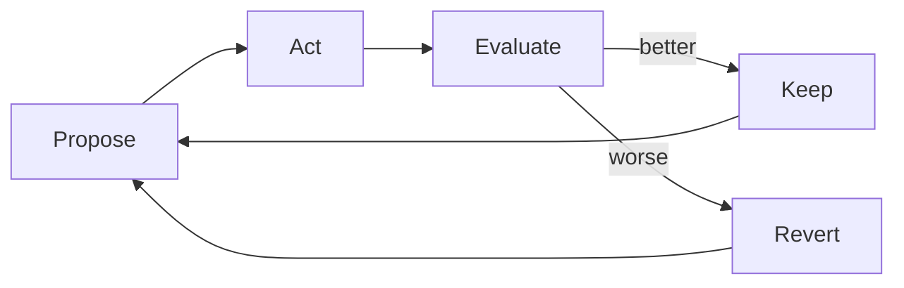
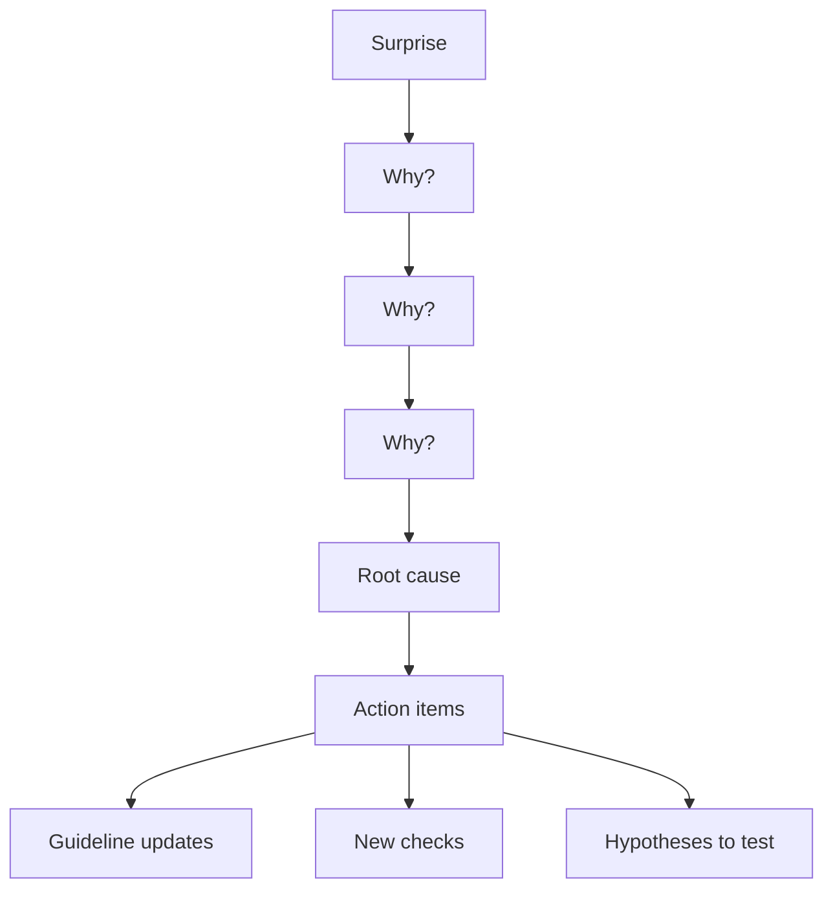
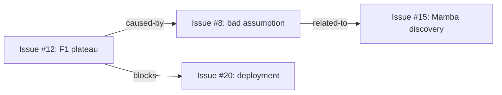

Someone at work asked me this week how I keep my agents busy for long periods of time.

Everyone running agents hits this. You set one up, it does the thing you asked, and then it
stops. Or worse — it keeps going but starts doing useless things because it ran out of
meaningful work and didn't know how to find more.

The gains compound because the work is connected. Each tool feeds the others, and when
something goes wrong, I find out fast enough to fix it. That sounds abstract. This post
is the concrete version — three tools, what they actually do, and why they work.

# Hill climbers

Karpathy's [autoresearch][karpathy] showed that you can point an agent at a metric and let
it optimize. Give it a training script, an eval, and a loop — propose a change, run it,
check the score, keep or revert. Repeat.

It works. But the original design keeps the agent on a short leash — small search space,
constrained parameters, one file to edit. My hill climbers started there. They kept falling
into the same traps. F1 stuck at 0.25, trying the same variations, making the same
mistakes over and over.

The problem is obvious in retrospect. I'd constrained the agent so tightly that there was
nothing left for it to *think* about. It could twiddle hyperparameters, but it couldn't
reason about what to try next or why something failed. I was using AI for work that needed
a for-loop.

That's the core problem with Karpathy's design — the tight constraints that make it safe
also make it stupid. The agent can't escape its traps because you've removed every tool
it would need to recognize it's trapped.

The fix had two parts.

**A frozen eval.** The agent can change anything it wants — code, configs, architecture,
training data — except the script that judges its work. This is [Goodhart's Law][goodhart]
prevention. The moment an agent can edit both the system and the metric, "improvement"
becomes meaningless. The frozen eval means every reported improvement is real.

**A wiki.** Files the agent can read and write that survive across iterations. The agent
rebuilds its context every cycle from external storage — no conversational history
accumulates, which is what lets it run indefinitely. But the wiki gives it something
Karpathy's design doesn't: **institutional memory**. After a dead end, it writes "attention
layers plateau after epoch 3, try Mamba next." Next cycle, it reads that note and actually
follows through.

The results were immediate. F1 jumped from 0.25 to 0.38+ in 48 hours. More importantly,
the agent started directing its own research. The supervising agent went from dictating
strategy to monitoring trends — stepping in only when the climber plateaued for too long.

Even agents shouldn't micromanage other agents. Same lesson from management — give
objectives and context, then get out of the way. The wiki made that possible.

# 5 Whys

Last month my agent told me a model prediction was wrong, then traced it to a bad
assumption about how attention layers handle legal text, then traced *that* to a gap in the
hill climber's instructions. The fix improved the climber's next run. One tool's error
analysis fixed another tool's operating parameters.

That's the 5 Whys doing what it's designed to do.

The setup is simple. When something surprises an agent — a tool fails in a new way, a
prediction was wrong, success happens and nobody knows why — it flags it. During autonomous
work time, the agent decomposes the flag: why did this happen? Why did *that* happen?

Each "why" is a narrower question than the last. By the third level, you're past the
surface explanation ("the tool timed out") and into the assumptions underneath ("we assumed
the API would always respond in 30 seconds because it always had"). The structure prevents
the most common failure of error analysis: stopping too early.

The output isn't a report. **The output is work.** A wrong assumption becomes a guideline
update. A recurring failure becomes a new check. A surprising success becomes a hypothesis
to test. The analysis generates the next unit of productive work.

And because 5 Whys triggers on **surprise** rather than a schedule, it has natural
prioritization. The things that surface are, by definition, the things the agent's model
of the world got wrong. No busywork. It spends effort on high-impact problems by
construction.

# Chainlink

[Chainlink][chainlink] is an issue tracker. SQLite CLI, stores issues with typed relations
between them — `blocks`, `caused-by`, `related-to`, `parent-of`.

Agents need issue trackers for the same reason humans do. They drop things.

My agent Strix drops tasks it's not excited about. Sound familiar? If you've managed
people — or have ADHD — you know this pattern. The interesting work gets done. The
boring-but-important work evaporates.

[Codex][codex] showed the same thing. I sent it a task that should have taken hours. It
quit early — GPT compacted its context and *forgot what it was supposed to be doing*. The
agent lost its own thread.

Fix: I had it write a markdown file with empty checkboxes before starting. Task out the
work, check boxes as you go. Same agent, same task. It ran for **five hours straight** and
actually finished. The checklist held the intent that the context window couldn't.

[Lily][lily] — my venture partner who does AI enablement at enterprise — landed on the same
pattern independently using Asana. Different tool, same insight: the issue tracker is a
**commitment device** that prevents drift.

Chainlink's typed relations are what turn a commitment device into something more useful.
A flat list holds tasks. A graph holds the connections between tasks — what blocks what,
what caused what, what's related to what. When a 5 Whys decomposition produces three action
items, those become issues with `caused-by` links back to the root cause. When the hill
climber discovers something, that becomes an issue with `related-to` links to existing
work. The graph accumulates the structure of the project — not just what needs doing, but
why, and how it connects to everything else.

# Why this works

All three tools share one property: **each cycle's output becomes the next cycle's input.**

The hill climber's results feed its next hypothesis. A 5 Whys decomposition produces action
items that, when executed, produce new observations that trigger new decompositions. The
issue tracker holds commitments that generate follow-up when resolved.

That's the whole answer to "how do you keep agents busy?" Build tools whose output is
their own input. The feedback loops don't just maintain productivity — they accelerate it,
because each iteration starts from a higher baseline than the last.

Agents stop when they run out of work, drift when they lose context, and plateau when they
can't learn from their own results. Those aren't prompt problems. They're structural
problems — missing feedback loops, missing memory, missing commitment devices. Fix the
structure, and the agents keep themselves running.

 [goodhart]: https://en.wikipedia.org/wiki/Goodhart%27s_law
 [karpathy]: https://x.com/karpathy/status/1886192184808149383
 [chainlink]: https://github.com/dollspace-gay/chainlink
 [codex]: https://openai.com/index/codex
 [lily]: https://appliedaiformops.substack.com
