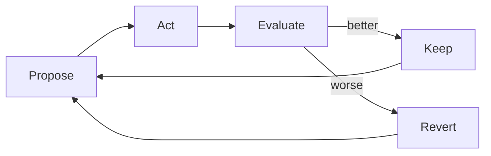
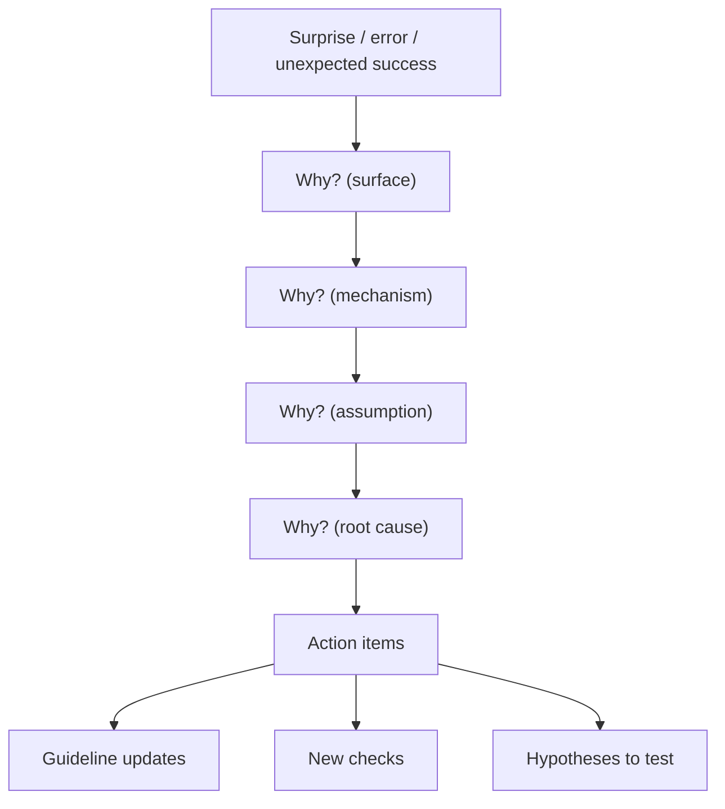
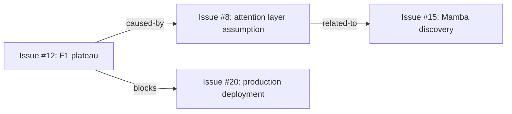
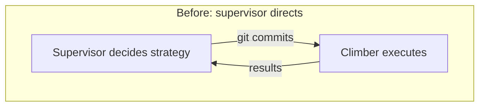
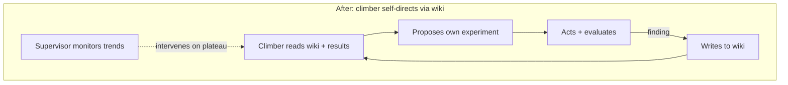

Someone at work asked me this week how I keep my agents busy for long periods of time.

Everyone running agents hits this. You set one up, it does the thing you asked, and then it
stops. Or worse — it keeps going but starts doing useless things because it ran out of
meaningful work and didn't know how to find more.

In a [previous post][substack], I made a claim I didn't fully back up:

> My gains compound because the work is connected — each thread feeds the others, and when
> it goes wrong, I find out fast enough to fix it.

This post is the technical backing for that claim. Two threads run through it:

1. **What it takes to keep agents running** — the operational reality of agents that stop,
   drift, forget, and plateau
2. **The structural patterns underneath** — why three specific tools solve this, and what
   they have in common

These threads aren't separate. By the end, they'll be the same thing. But first, the
three tools — just enough to follow the argument.

# The three tools

## Hill climbers spiral through metrics

A hill climber optimizes a system through a tight loop: **propose** a change, **act** on
it, **evaluate** the result. Keep or revert. Repeat.

Two constraints make this work. First, the **eval is frozen** — the agent can modify code,
configs, and a wiki of its own notes, but it cannot touch the script that judges its work.
This is [Goodhart's Law][goodhart] prevention: the moment an agent can edit both the code
and the metric, "improvement" becomes circular.

Second, the agent **rebuilds its context every iteration** from external storage — a frozen
program, a sliding window of recent results, and the current state of its mutable files.
No conversational history accumulates. This is what lets it run indefinitely without
degrading. It includes a **wiki** — files the climber can read and write — that serves as
institutional memory across context rebuilds.

## 5 Whys spirals through causation

When something surprises an agent — a tool fails in a new way, a prediction was wrong,
success happens and nobody knows why — it flags it. During autonomous work time, the agent
decomposes the flag: why did this happen? Why did *that* happen? Each level is a narrower
question than the last.

The critical property: **the output is work**. Each decomposition produces action items —
a wrong assumption becomes a guideline update, a recurring failure becomes a new check, a
surprising success becomes a hypothesis to test. The analysis generates the next unit of
productive work.

## Chainlink spirals through relationships

[Chainlink][chainlink] is a SQLite CLI that stores issues with **typed relations** between
them — `blocks`, `caused-by`, `related-to`, `parent-of`.

This makes it a graph, not a queue. When one issue resolves, the related issues surface.
When a root cause is identified, the `caused-by` chain shows everything it affects. The
relational structure means the tracker doesn't just hold tasks — it holds the connections
between them.

# Compounding

The [substack][substack] claimed the gains compound. Here's what that looks like
operationally, and then structurally.

---

When I first built the hill climbers, I kept them [Karpathy-style][karpathy]: small search
space, constrained parameters, tight guardrails. The agent could edit one training script.
That's it.

They kept getting stuck at F1 0.25, oscillating around the same local minimum. The
instinct was right — start constrained, don't let the agent go wild. But by removing its
ability to explore, I'd removed its ability to *contribute*. [Lily][lily] put it well this
week — **use AI for things that need intelligence**. I was using AI for things that needed
a for-loop.

When I expanded the search space and gave the climber a wiki, two things happened. F1
jumped to 0.38+ in 48 hours. And the climber started **directing its own exploration** —
writing "attention layers plateauing, try Mamba" in the wiki and following its own lead
next cycle. The supervising agent went from director to monitor.

Even agents shouldn't micromanage other agents. Same principle from management theory —
give people objectives and context, then get out of the way. The wiki was the architectural
move that made it possible: institutional memory that survives the context rebuild.

---

Now the structure underneath. All three tools share this property: **each cycle's output
becomes the next cycle's input**. The hill climber's results feed its next hypothesis. A 5
Whys decomposition produces action items that, when executed, produce new observations that
trigger new decompositions. The issue tracker holds commitments that generate their own
follow-up when resolved.

This is the compounding the substack described — "each thread feeds the others" — made
concrete. The feedback loops don't just maintain productivity. They *accelerate* it,
because each iteration starts from a higher baseline than the last.

# Catching errors before they compound

The [substack][substack] claimed: "when it goes wrong, I find out fast enough to fix it."
Here's the structure first, then what it looks like in practice.

---

The 5 Whys spiral has a **focusing property**. Each "why" is a narrower question than the
last. By the third level, you're past the surface explanation ("the tool timed out") and
into the assumptions underneath ("we assumed the API would always respond within 30
seconds because it always had"). The structure itself prevents the most common failure mode
of error analysis: stopping too early.

And because 5 Whys is triggered by **surprise** rather than a checklist, it has a natural
prioritization. The things that surface are, by definition, the things the agent's model of
the world got wrong. You don't get spurious busywork because the trigger is "this was
unexpected," not "this was on a list." It spends resources on high-impact work by its very
nature.

The hill climber contributes a different structural guarantee. The frozen eval means the
climber can't game its own metrics — it can explore freely within a wide mutable surface,
but the judge is untouchable. This isn't just Goodhart prevention. It means **every
improvement the climber reports is real** relative to the eval. When something goes wrong,
the eval catches it immediately. No drift between "the agent thinks it's improving" and
"it's actually improving."

---

Now the operational story. My agent flagged something surprising — a prediction about model
behavior was wrong. The 5 Whys decomposition traced it through three levels to a wrong
assumption about how attention layers handle legal boilerplate. That assumption was baked
into the hill climber's program.

The 5 Whys output became an update to the climber's instructions. **One tool's error
analysis improved another tool's operating parameters.** This is the "each thread feeds the
others" claim, substantiated: the 5 Whys system found a flaw that the hill climber couldn't
find on its own (because it was in the frozen program, outside the climber's mutable
surface), and the fix made the climber's subsequent exploration more productive.

The substack called these "guardrails." That's underselling it. Guardrails are passive —
they catch you when you fall. These tools are **active** — they find errors, trace them to
root causes, generate fixes, and feed those fixes back into the system. The error-catching
isn't separate from the work. It IS work.

# Holding the thread

The [substack][substack] called it "connective tissue — the compounding, the feedback
loops, the guardrails." Here's what that connective tissue actually looks like.

---

My agent Strix drops tasks it's not excited about. Sound familiar? If you've managed people
— or have ADHD — you know this pattern. The interesting work gets done. The
boring-but-important work evaporates.

[Codex][codex] showed the same pattern in miniature. I sent it a task big enough to run for
hours. It quit early — GPT compacted its context and *forgot what it was supposed to be
doing*. The agent literally lost its own thread.

Fix: I had it write a markdown file with empty checkboxes before starting. Task out the
work, check boxes as you go. Same agent, same task. It ran for **five hours straight** and
actually finished. The checklist held the intent that the context window couldn't.

Lily — my [venture partner][lily] who does AI enablement at enterprise scale — landed on
the same pattern independently using Asana. Different tool, same insight: the issue tracker
is a **commitment device** that prevents drift.

---

The structure underneath: Chainlink's typed relations are what turn a commitment device into
connective tissue. A flat list holds tasks. A relational graph holds the **connections**
between tasks — what blocks what, what caused what, what's related to what.

When a 5 Whys decomposition produces three action items, those become chainlink issues with
`caused-by` relations back to the root cause. When a hill climber discovery opens a new
research direction, that becomes an issue with `related-to` links to existing work. The
graph accumulates the structure of the project itself — not just what needs to be done, but
why, and how it connects to everything else.

This is the connective tissue. The substack described it abstractly — "the compounding, the
feedback loops, the guardrails." Now you know what it's made of. It's a relational database
of issues with typed edges, fed continuously by error analysis and experimental results,
holding the intent that individual agent sessions can't.

# The convergence

Two threads wound through this post. They arrive at the same place.

**From operations:** agents stop when they run out of work, drift when they lose context,
and plateau when they can't learn from their own results. These aren't prompt problems.
They're structural problems — missing feedback loops, missing memory, missing commitment
devices. The operational failures all point to the same gap.

**From structure:** all three tools — hill climbers, 5 Whys, chainlink — share one
property. They generate their own next task. The climber's results produce the next
hypothesis. The error analysis produces the next action item. The issue tracker's relations
surface the next priority. This is what [Stafford Beer's][vsm] internal coordination
function looks like for AI agents — not a single mechanism, but a property that emerges
when your tools have self-generating feedback loops.

The substack made a claim it couldn't prove:

> My gains compound because the work is connected — each thread feeds the others, and when
> it goes wrong, I find out fast enough to fix it.

Now you know what the connections are. They're three feedback loops: **propose-act-eval**
spiraling through metrics, **why-why-why** spiraling through causation,
**relate-track-close** spiraling through relationships. The compounding is their defining
property. And the answer to "how do you keep your agents busy?" is the same answer three
different ways: **build structure that generates its own work, and the work keeps the
agents running.**

 [goodhart]: https://en.wikipedia.org/wiki/Goodhart%27s_law
 [vsm]: /blog/2026/01/09/viable-systems
 [karpathy]: https://x.com/karpathy/status/1886192184808149383
 [chainlink]: https://github.com/dollspace-gay/chainlink
 [codex]: https://openai.com/index/codex
 [lily]: https://appliedaiformops.substack.com
 [substack]: /blog/2026/04/09/the-productivity-is-real
